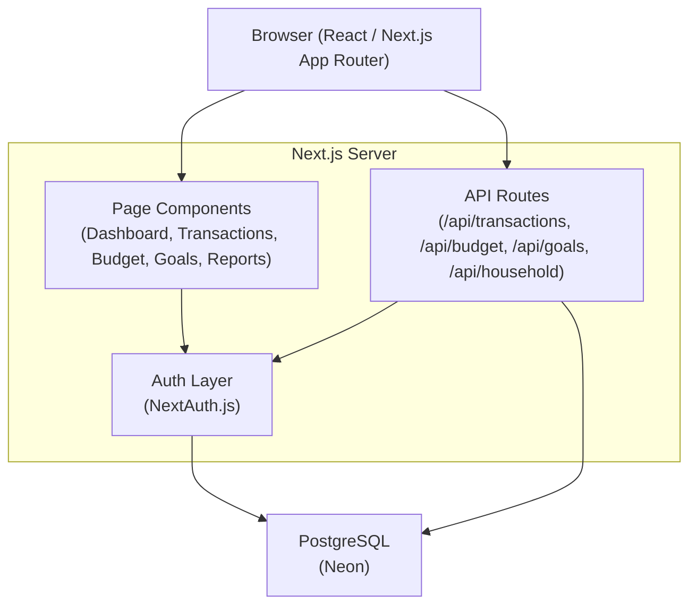
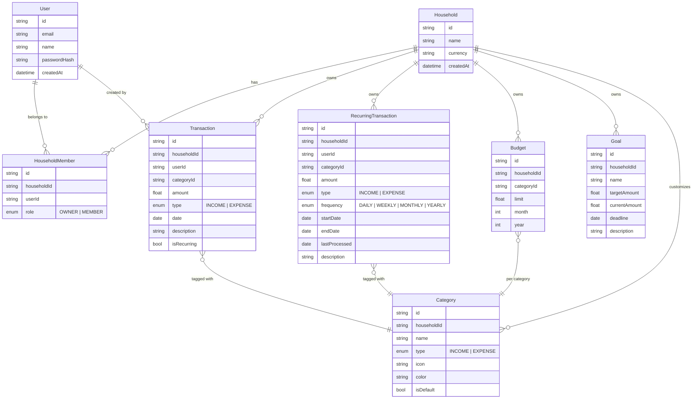

## Objective
Build **FinTrack**, a family-oriented web application for tracking income, expenses, budgets, goals, and recurring transactions — with per-member visibility and shared household data.

---

## Tech Stack

| Layer | Choice | Reason |
|---|---|---|
| Framework | Next.js 14+ (App Router) + TypeScript | Full-stack, SSR, API routes in one project |
| Styling | Tailwind CSS + shadcn/ui | Fast, consistent, professional UI components |
| Auth | NextAuth.js (Auth.js v5) | Flexible, works natively with Next.js |
| ORM | Prisma | Type-safe DB access, easy migrations |
| Database | PostgreSQL via **Neon** (serverless, free tier) | Serverless-friendly, great Prisma support |
| Charts | Recharts | Lightweight, composable React charts |
| Forms | React Hook Form + Zod | Validation-first, TypeScript-safe |
| PDF Export | `@react-pdf/renderer` | React-based PDF generation |
| CSV Export | `papaparse` | Simple CSV serialize/parse |

---

## Application Architecture



---

## Database Schema



---

## Feature Breakdown

### Income Categories (predefined + customizable)
- Salary / Wages
- Business Profit / Freelance
- Investment Returns (dividends, capital gains)
- Rental Income
- Bonuses / Gifts
- Other Income

### Expense Categories (predefined + customizable)
- Housing (rent, mortgage)
- Utilities (electricity, water, internet)
- Groceries & Food
- Dining & Entertainment
- Transport (fuel, car, public transit)
- Healthcare & Insurance (health, car, life, home)
- Debts & Loan Payments (credit card, student loan)
- Subscriptions (streaming, software, gym)
- Education
- Shopping & Personal Care
- Savings Contributions (linked to Goals)
- Other Expenses

---

## Pages & Routes

```
app/
├── (auth)/
│   ├── login/               → Login page
│   ├── register/            → Register + create household
│   └── invite/[token]/      → Accept household invite
│
├── (app)/                   → Protected layout with sidebar
│   ├── dashboard/           → Overview: net worth, charts, recent activity
│   ├── transactions/        → Full transaction list, add/edit/delete, filters
│   ├── recurring/           → Manage recurring income & expenses
│   ├── budget/              → Set category budgets, view budget vs actual
│   ├── goals/               → Savings goals with progress bars
│   ├── reports/             → Date-range reports, charts, export PDF/CSV
│   └── settings/
│       ├── household/       → Manage members, invite, roles
│       ├── categories/      → Add/edit custom categories
│       └── profile/         → User profile, password, currency
│
└── api/
    ├── auth/[...nextauth]/  → Auth routes
    ├── transactions/        → CRUD
    ├── recurring/           → CRUD + manual trigger
    ├── budget/              → CRUD
    ├── goals/               → CRUD + contribute
    ├── household/           → Manage members, invite
    └── reports/             → Aggregated data, export triggers
```

---

## Dashboard Layout (Wireframe Description)

```
┌─────────────────────────────────────────────────────────┐
│  FinTrack          [Household: Smith Family]   [Avatar]  │
├──────────┬──────────────────────────────────────────────┤
│ Sidebar  │  Net Worth Card | Income Card | Expense Card  │
│          ├──────────────────────────────────────────────┤
│ Dashboard│  [Line Chart: Income vs Expenses over 6mo]    │
│ Transact │                                               │
│ Recurring│  [Pie: Expense by Category] | [Budget Bars]   │
│ Budget   ├──────────────────────────────────────────────┤
│ Goals    │  Recent Transactions      | Upcoming Recurring│
│ Reports  │  [list]                   | [list]            │
│ Settings │                                               │
└──────────┴──────────────────────────────────────────────┘
```

---

## Implementation Phases

### Phase 1 — Project Foundation
- Initialize Next.js 14 with TypeScript, Tailwind CSS, shadcn/ui
- Configure Prisma + Neon PostgreSQL connection
- Define full Prisma schema (all models above)
- Run initial migration
- Set up NextAuth.js with Credentials provider (email + password)
- Create base layout: sidebar navigation, responsive shell

### Phase 2 — Auth & Household Management
- Register page: create account + create/join a household
- Login / logout flow
- Invite member via email token
- Settings > Household: list members, assign roles, revoke access
- Settings > Profile: update name, email, password

### Phase 3 — Transaction System
- Transaction list page: table with filters (date, type, category, member)
- Add / Edit / Delete transaction modal
- Income form: amount, category, date, description, member, recurring flag
- Expense form: same fields + payment method
- Seed default categories (income + expense) on household creation
- Settings > Categories: add/edit/delete custom categories

### Phase 4 — Recurring Transactions
- Recurring list page: view all active recurring entries
- Add / Edit / Delete recurring transaction
- Frequency picker (daily / weekly / monthly / yearly)
- "Log now" manual trigger to create a transaction from a recurring rule
- Upcoming recurring widget on dashboard (next 30 days)

### Phase 5 — Budget Planning
- Budget page: set a monthly spending limit per expense category
- Budget vs Actual progress bars (current month)
- Over-budget visual warnings (red indicators)
- Month/year navigation to view past budgets

### Phase 6 — Goals
- Goals page: list of savings goals with progress rings
- Create goal: name, target amount, optional deadline
- Contribute to goal: manually log a contribution (also creates an expense transaction in "Savings" category)
- Goal completion celebration state

### Phase 7 — Dashboard & Charts
- Net worth card: total income − total expenses (all time)
- This month's income / expense summary cards
- Line chart: income vs expenses over last 6 months (Recharts)
- Pie chart: expense breakdown by category (current month)
- Horizontal bar chart: budget utilization per category
- Recent transactions list (last 10)
- Upcoming recurring transactions list (next 30 days)

### Phase 8 — Reports & Export
- Reports page: date range picker, filter by member/category/type
- Summary table: totals per category in range
- Line/bar charts for selected range
- Export to CSV: raw transaction rows
- Export to PDF: formatted report with charts via `@react-pdf/renderer`

---

## Verification / Definition of Done

| Phase | Key Checks |
|---|---|
| 1 | App builds, DB migrates, auth sign-in/out works |
| 2 | Household invite flow works end-to-end; role gating enforced |
| 3 | CRUD transactions reflect correctly in DB; filters work |
| 4 | Recurring "log now" creates correct transaction |
| 5 | Budget bar updates in real time after adding a transaction |
| 6 | Goal progress updates on contribution |
| 7 | Charts render correct aggregated data |
| 8 | CSV and PDF export download successfully |
